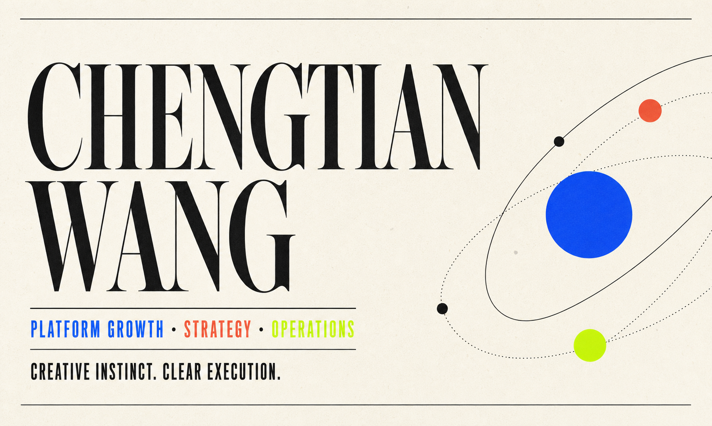

# Chengtian Wang — Portfolio

[View the live portfolio](https://chengtian-wang-portfolio.saizhui.chatgpt.site)



A responsive portfolio for Chengtian Wang, presenting experience across platform
growth, creator partnerships, campaign strategy, operations, data-informed
planning, and entertainment.

## Highlights

- Editorial, responsive homepage with selected experience and capabilities
- Horizontally browsable recent-project cards with keyboard-accessible controls
- Six project case-study routes with original presentation and proposal PDFs
- Lazy-loaded project media to keep the initial page lightweight
- Accessible landmarks, labels, navigation, and reduced-motion support
- Automated rendered-HTML checks for core content and project metadata

## Technology

- [Next.js](https://nextjs.org/) 16 and React 19
- [vinext](https://github.com/cloudflare/vinext) and Vite
- Cloudflare Workers-compatible server output
- TypeScript and CSS
- Node's built-in test runner and ESLint

## Local Development

### Requirements

- Node.js 22.13 or newer
- npm

### Setup

```bash
git clone <your-repository-url>
cd personal-site
npm ci
npm run dev
```

The development server prints the local URL after startup.

## Available Commands

| Command | Purpose |
| --- | --- |
| `npm run dev` | Start the local development server |
| `npm run build` | Create the production build in `dist/` |
| `npm run start` | Run the production build locally |
| `npm run lint` | Check source quality |
| `npm test` | Build and run rendered-page regression tests |
| `npm run check` | Run lint, build, and regression tests |

## Project Structure

```text
app/
  components/           Shared project-carousel components
  projects/             Individual project case studies
  globals.css           Site-wide responsive styles
  layout.tsx            Metadata and document shell
  page.tsx              Portfolio homepage
public/
  projects/             Case-study covers and original PDFs
  chengtian-wang-resume.pdf
scripts/
  assemble-rednote-pdf.mjs
source-assets/
  rednote-assignment/   Versionable source parts for the RedNote PDF
tests/
  rendered-html.test.mjs
worker/
  index.ts              Cloudflare Worker entry point
```

## Content Notes

- Homepage content and experience data live in `app/page.tsx`.
- Recent-project metadata lives in `app/components/RecentProjects.tsx`.
- The downloadable résumé is `public/chengtian-wang-resume.pdf`.
- Project PDFs and covers are grouped under `public/projects/<project-name>/`.
- The RedNote PDF is reconstructed during the build from the tracked files in
  `source-assets/rednote-assignment/`; the generated PDF is intentionally
  ignored by Git.

## Quality Checks

Every push and pull request runs the workflow in `.github/workflows/ci.yml`.
It installs dependencies from the lockfile, checks the code, builds the site,
and runs the rendered-page regression suite. Dependabot checks for npm updates
weekly and proposes reviewable pull requests.

## Deployment

`npm run build` generates a Cloudflare Workers-compatible application in
`dist/`. The current production site is hosted with OpenAI Sites; the source can
also be connected to a compatible Cloudflare deployment workflow.

## License

Copyright © 2026 Chengtian Wang. All rights reserved.
